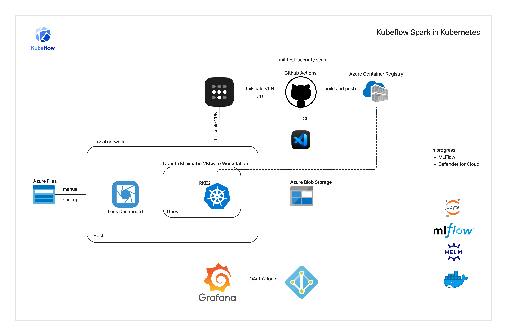

# Kubernetes lab

I built a secure CI/CD pipeline to automate deployments for Apache Spark jobs using the Kubeflow Spark Operator on Kubernetes (RKE2). This project focuses on secure ML pipelines, scalable data transformations, and cloud-native orchestration.

Tech Stack & Tools:

Kubernetes (RKE2) – Cluster orchestration
Kubeflow Spark Operator – Managing Spark workloads on Kubernetes
Apache Spark – Distributed data transformations
GitHub Actions – CI/CD for automated Spark job deployment
Tailscale – Secure cluster access
Azure Entra ID – Authentication and IAM
Grafana Cloud and Lens – Monitoring

Key Highlights:

Automated Spark job deployments using the Kubeflow Spark Operator
Integrated GitHub Actions for secure and efficient CI/CD workflows
Used Azure Container Registry for managing and securing container images
Stored transformed data in Azure Storage for scalability and accessibility
Configured Azure Files for backup of the Kubernetes cluster
Used Tailscale for secure remote access to the cluster
Implemented IAM integration and security best practices with Grafana Cloud and Azure Entra ID
Designed for scalability, allowing efficient Spark job execution on Kubernetes
